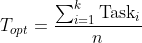
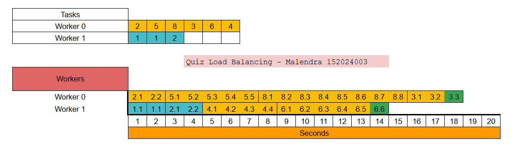

# Quiz Dynamic Load Balancing: Work Stealing
Implementasi algoritma Work Stealing untuk mendapatkan Expected Optimal Time.

### Logika 

##### Dimana:
* **$T_{opt}$**: Expected Optimal Time.
* **$\sum \text{Task}_i$**: Jumlah total beban seluruh task.
* **$n$**: Jumlah worker/processor.

### Eksekusi
* Static Init: Loading queue; $T_{opt}$ dihitung sebagai benchmark.
* Local Processing: Worker mengeksekusi tasks masing-masing.
* Theft Trigger: Ketika queue suatu worker mencapai nol, worker melakukan scanning task worker lain untuk surplus task.
* Task Migration: Task yang berat secara dinamis dipindahkan ke worker yang idle.
* Termination: Ketika seluruh queue sudah kosong, sistem berhenti.

### Contoh Pekerjaan
* Worker 0: [2, 5, 8, 3, 6, 4]
* Worker 1: [1, 1, 2]
